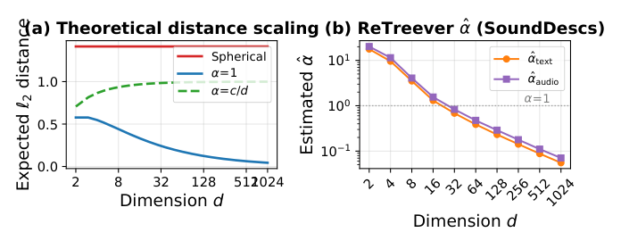
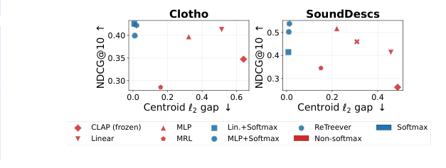
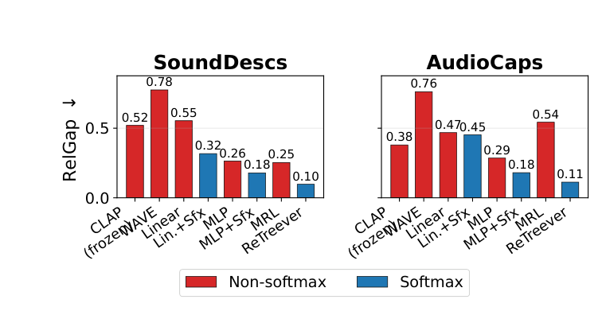
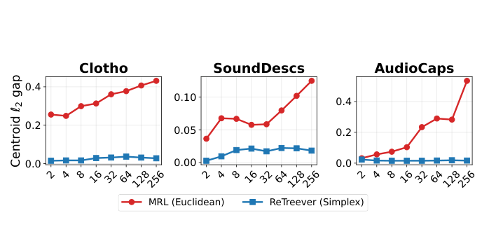

# Closing the Modality Gap via Simplex-Constrained Representations

**Shubham Gupta**¹²⁴, **Siva Reddy**¹²³, **Perouz Taslakian**¹²³, **Valentina Zantedeschi**²⁴, **Cem Subakan**¹⁴
¹ Mila – Québec AI Institute · ² ServiceNow Research · ³ McGill University · ⁴ Université Laval
*Interspeech 2026* · **paper: [PDF](docs/modality_gap/Closing_the_Modality_Gap_Interspeech2026.pdf)** · code: <https://github.com/ServiceNow/retreever>

<p align="center"></p>

Contrastive multimodal models such as CLIP and CLAP learn a shared space, but their embeddings keep a persistent **modality gap**: the two modalities occupy systematically offset regions. This paper closes that gap with a purely geometric change — moving the embedding domain from the unit sphere **S^(d−1)** to the probability simplex **Δ^(d−1)** — using lightweight softmax adapters on frozen backbones and a Total-Variation similarity. Across five retrieval benchmarks the centroid ℓ₂ gap falls by **97–99%** while NDCG@10 matches or exceeds the unconstrained models.

| | |
|---|---|
| Backbones (frozen) | LAION-CLAP (audio–text), FLAVA (image–text) |
| Benchmarks | Clotho, AudioCaps, SoundDescs, MS-COCO Captions, Flickr30k |
| Trainable parameters | < 1 % (lightweight shared adapters) |
| Training | symmetric in-batch InfoNCE (DPR-style), 200K steps, AdamW lr 4×10⁻⁴, batch 64, learnable temperature |
| Gap reduction | centroid ℓ₂ 0.36–0.81 → 0.005–0.020 (97–99 %) |

## Idea

Both the sphere and the simplex are (d−1)-dimensional, but they encode different symmetries.

- **Sphere.** Cosine similarity is invariant to rotations, reflections and sign flips, so many equivalent solutions exist in which matched pairs align while the two modality distributions stay offset.
- **Simplex.** Embeddings are nonnegative and sum to one, so both modalities must allocate a shared probability budget over the same coordinates. With softmax, the representation is also invariant to global logit shifts — an additional cross-modal normalisation.

## Method

1. A frozen encoder *f* produces a pooled embedding **h** ∈ ℝ^d for each input (text, audio or image).
2. A lightweight *shared* adapter *g*θ (Linear or 2-layer MLP) maps it to logits **z** = *g*θ(**h**).
3. Two output domains, same adapter:
   - **Euclidean:** **e** = **z** / ‖**z**‖₂ ∈ S^(d−1), scored by cosine similarity.
   - **Simplex:** **p** = softmax(**z**) ∈ Δ^(d−1), scored by negative Total Variation, s_TV = −½ ‖**p**_u − **p**_v‖₁.
4. Training: symmetric in-batch contrastive loss L = ½ (L^(t→x) + L^(x→t)) with the InfoNCE form of DPR; only the scoring function differs between the two branches.

### Baselines (matched capacity, matched form)

| Configuration | Output | Score |
|---|---|---|
| Frozen encoder (CLAP / FLAVA) | Euclidean | cosine |
| Linear / MLP adapter | Euclidean | cosine |
| Linear / MLP adapter + softmax (Lin.+Sfx, MLP+Sfx) | simplex | −TV |
| XAttn — 100 shared 1024-d learned queries cross-attending to token-level features, mean-pooled | Euclidean | cosine |
| ReTreever — the same cross-attention, multi-resolution simplex outputs via softmax | simplex | −TV |
| MRL — multi-resolution Euclidean (prefix slices of one embedding) | Euclidean | cosine |

### Metrics

- **Centroid ℓ₂** = ‖μ_A − μ_B‖₂ between the two modality centroids.
- **Silhouette**: mean per-point (b − a) / max(a, b), with a the mean intra-modality distance and b the mean nearest-modality distance.
- **RelGap** (Eq. 1): centroid separation normalised by intra-modality spread, so Euclidean and simplex outputs can be compared fairly:

  RelGap(A, B) = ‖μ_A − μ_B‖₂ / √( 2 (E‖x_A − μ_A‖₂² + E‖x_B − μ_B‖₂²) )

- **Retrieval**: NDCG@10 in both directions (T2A / A2T, T2I / I2T).

### Distances on the sphere vs. the simplex



*Figure 1. (a) Expected ℓ₂ distance vs. dimension. Sphere: plateau at √2. Dense simplex (α = 1): shrinks as O(1/√d). Sparse simplex (α = c/d): plateau at √(2/(c+1)). (b) Dirichlet α̂ estimated from learned ReTreever embeddings (SoundDescs); as dimension grows α̂ ≪ 1, placing the embeddings in the sparse regime where distances plateau rather than contract.*

On S^(d−1), random unit vectors become nearly orthogonal and E‖x − y‖₂² = 2. On the simplex, for p, q ~ Dir(α, …, α): E‖p − q‖₂² = 2(α+1)/(dα+1) − 2/d — dense embeddings (fixed α) contract as O(1/√d), sparse ones (α = c/d) plateau at ≈ 2/(c+1). The regime of learned embeddings is estimated by moment matching, α̂ = (1 − s)/(s·d − 1) with s = E‖p‖₂².

## Results

### Table 1 — Audio–text (frozen LAION-CLAP)

Gap: centroid ℓ₂, RelGap (RG), silhouette (Sil) — lower is better. Retrieval: NDCG@10 — higher is better. **Bold** = best per column; simplex rows marked ▲.

| Adapter | Clotho ℓ₂ | RG | Sil | T2A | A2T | SoundDescs ℓ₂ | RG | Sil | T2A | A2T | AudioCaps ℓ₂ | RG | Sil | T2A | A2T |
|---|---|---|---|---|---|---|---|---|---|---|---|---|---|---|---|
| CLAP (frozen) | .640 | .748 | .197 | .259 | .436 | .488 | .521 | .117 | .273 | .250 | .363 | .380 | .067 | .596 | **.507** |
| Linear | .514 | .689 | .167 | .373 | .453 | .458 | .554 | .133 | .410 | .418 | .366 | .468 | .139 | .584 | .439 |
| MLP | .323 | .353 | .064 | .358 | .436 | .220 | .264 | .033 | .520 | .514 | .266 | .285 | .049 | .587 | .448 |
| XAttn | .450 | .443 | .126 | .353 | .432 | .309 | .331 | .051 | .464 | .456 | .297 | .321 | .053 | .592 | .452 |
| ▲ Lin.+Sfx | **.007** | .468 | .127 | **.382** | **.470** | **.007** | .317 | .053 | .412 | .418 | .009 | .453 | .085 | .572 | .423 |
| ▲ MLP+Sfx | .011 | .336 | .089 | .361 | .438 | .010 | .179 | .018 | .507 | .499 | **.006** | .180 | .012 | **.597** | .451 |
| ▲ ReTreever | .020 | **.181** | **.026** | .381 | .464 | .012 | **.097** | **.006** | **.535** | **.542** | .011 | **.113** | **.000** | .590 | .444 |

### Table 2 — Image–text (frozen FLAVA)

| Adapter | COCO ℓ₂ | RG | Sil | T2I | I2T | Flickr30k ℓ₂ | RG | Sil | T2I | I2T |
|---|---|---|---|---|---|---|---|---|---|---|
| FLAVA (frozen) | .810 | 1.00 | .336 | .630 | .529 | .731 | .891 | .285 | .801 | .695 |
| Linear | .647 | .732 | .212 | **.711** | **.644** | .543 | .598 | .151 | **.858** | .817 |
| MLP | .411 | .438 | .088 | .688 | .615 | .246 | .277 | .036 | .828 | .792 |
| XAttn | .615 | .666 | .182 | .708 | .641 | .527 | .563 | .136 | .857 | **.819** |
| ▲ Lin.+Sfx | .020 | .814 | .247 | .655 | .565 | .019 | .721 | .200 | .827 | .774 |
| ▲ MLP+Sfx | .009 | .233 | .028 | .674 | .594 | .007 | .166 | .014 | .833 | .790 |
| ▲ ReTreever | **.007** | **.221** | **.026** | .694 | .613 | **.005** | **.129** | **.008** | .837 | .799 |

### The gap collapses while retrieval is preserved (§5.1)

- On frozen backbones the centroid ℓ₂ gap is 0.36–0.81. Adding a softmax to the *same* Linear/MLP adapter reduces it to 0.005–0.020 — a 97–99 % reduction (COCO 0.810 → 0.009 with MLP+Sfx; Flickr30k 0.731 → 0.007).
- RelGap, which discounts any uniform rescaling of distances, is also lowest for simplex methods: SoundDescs 0.521 (frozen) → 0.179 (MLP+Sfx) → 0.097 (ReTreever); AudioCaps 0.380 → 0.180 → 0.113.
- Retrieval does not trade off: on Clotho, Lin.+Sfx improves T2A NDCG@10 from 0.259 to 0.382; on SoundDescs, ReTreever has the best retrieval in both directions (0.535 / 0.542) with a very small gap.



*Figure 2. Modality gap (centroid ℓ₂) vs. average retrieval NDCG@10 on Clotho and SoundDescs. Softmax methods (blue) cluster at low gap with competitive retrieval; non-softmax methods (red) spread across higher gaps.*

### Cross-attention is not what closes the gap (§5.2)

XAttn and ReTreever share the same learned-query cross-attention; only the output domain differs. XAttn keeps gaps comparable to the other Euclidean baselines, ReTreever collapses them: SoundDescs ℓ₂ 0.309 → 0.012 and RelGap 0.331 → 0.097; Flickr30k ℓ₂ 0.527 → 0.005 and RelGap 0.563 → 0.129. Large Euclidean cross-attention models such as WAVE-7B also retain large relative gaps.



*Figure 4. RelGap across adapter types on SoundDescs (left) and AudioCaps (right); non-softmax methods in red, softmax methods in blue; lower is better.*

### Coarse-to-fine: Euclidean gaps grow with dimension, simplex gaps stay small (§5.3)



*Figure 3. Coarse-to-fine modality gap: MRL (Euclidean, red) vs. ReTreever (simplex, blue) across representation dimensions.*

MRL's gap grows with resolution — on AudioCaps from 0.032 at 2-d to 0.534 at 256-d (17×) — while ReTreever stays below 0.06 at every resolution.

### Learned simplex embeddings lie in the sparse regime (§5.4)

On SoundDescs the estimated Dirichlet concentration α̂ falls from ≈18 at d = 2 to ≈0.06 at d = 1024, crossing α = 1 by d = 16 (Figure 1b). High-dimensional ReTreever embeddings are therefore in the sparse regime, where baseline distances plateau rather than contract — so the small gap reflects cross-modal alignment, not a shrunken distance scale.

## Conclusions

- Projecting embeddings onto the simplex reduces the centroid ℓ₂ modality gap by 97–99 % on five benchmarks while matching or improving retrieval; RelGap improves as well.
- Matched Euclidean baselines (XAttn, WAVE-7B) show that shared cross-attention alone does not reliably remove the gap; the simplex projection is the central factor.
- Euclidean coarse-to-fine gaps grow with dimension; simplex gaps remain small across resolutions, and the sparse-regime analysis supports alignment rather than a distance-scale artefact.
- Simplex embeddings are compositional and interpretable, and admit information-theoretic similarities (JS, Hellinger, KL) as alternatives to cosine.

## Citation

```bibtex
@inproceedings{gupta2026closing,
  title     = {Closing the Modality Gap via Simplex-Constrained Representations},
  author    = {Gupta, Shubham and Reddy, Siva and Taslakian, Perouz and Zantedeschi, Valentina and Subakan, Cem},
  booktitle = {Proc. Interspeech 2026},
  year      = {2026},
  note      = {Code: \url{https://github.com/ServiceNow/retreever}}
}
```

## Acknowledgements

We acknowledge the support of the Natural Sciences and Engineering Research Council of Canada (NSERC) and the Digital Research Alliance of Canada (alliancecan.ca).
